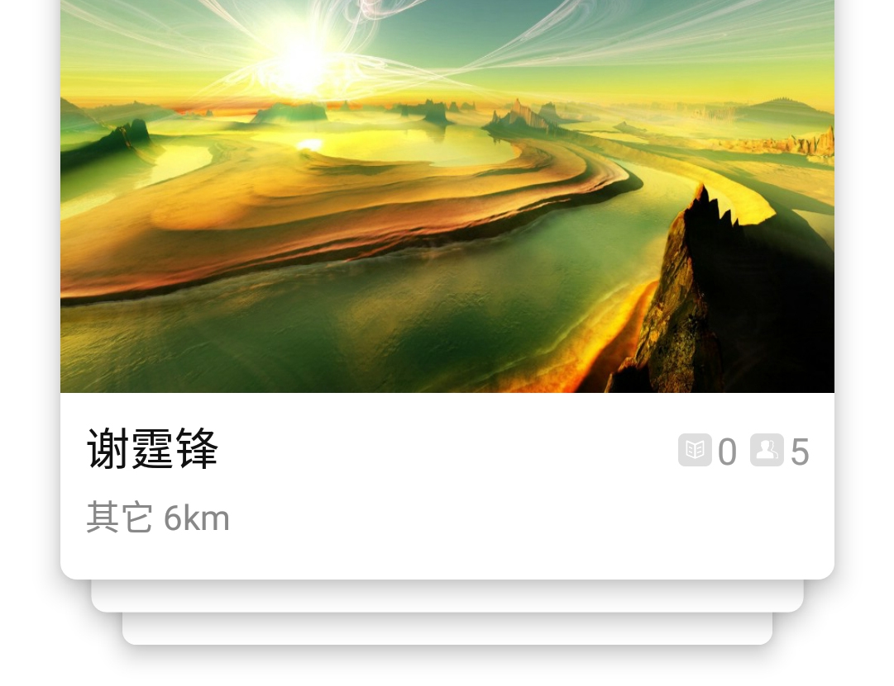
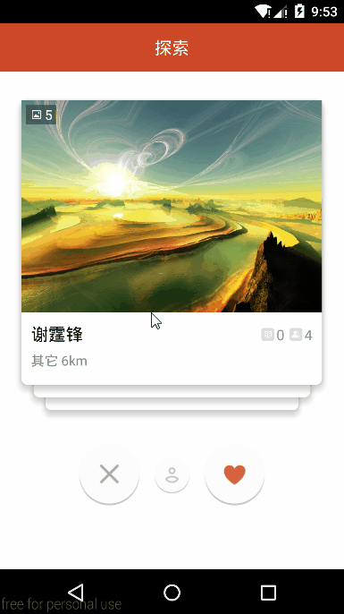
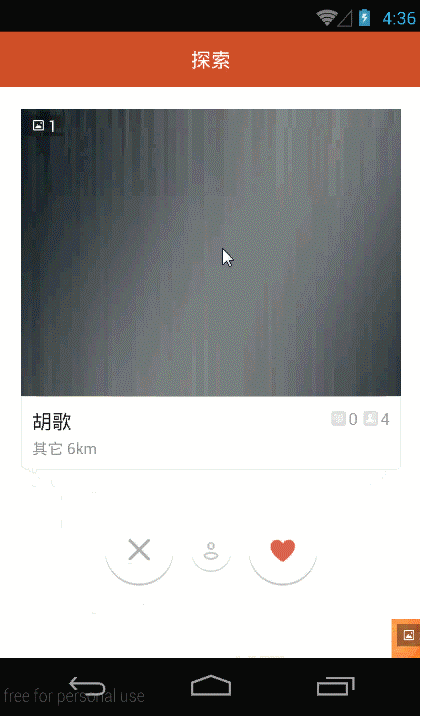

### 序言
故事的起点是这样的- 
* 有一个技术讨论的QQ群，里面活跃着一群技术牛人。他们技艺精湛，飞天遁地，无所不能。他们知道你所不知的技术，玩过你没有玩过的App。 
* 在一个月高风黑的晚上，一个素未谋面的大侠说：“探探”app做的甚好，滑动流畅，阴影效果32个赞。致敬经典，心怀崇拜之情，我偷偷下载了这个app，然后在四下无人的时候，注册了账号，打开了app。 
* 确实惊艳至极，实至名归！卡片式的交互体验，是一种新的感受！曾几何时，有一位兄台说过：“boss直聘”app的“每日推荐”左右滑动效果略屌。当时我也下载了，安装了，注册了，还被公司HR发现了。只是当时，感觉ui有点小卡（不要打我，我怕疼）。 
* 时过境迁，“探探”摆在眼前，我知道ViewDragHelper到底能有多牛逼了。终于，我下定了决心要做好这个project。
 

请看图:

### 有图有真相
<td>
	  
	 
	 
</td>

### 正经一点
不得不说，探探的ui效果真的很赞。在着手这个project之前，我没有参考过github上其它类似的开源项目。所以，如果这个project重复造了轮子，请不要打我。为了叙述上的方便，该项目代号为thisProj，没意见吧？ 
在thisProj竣工之时，有一个小伙伴发了我另一个开源工程，跟thisProj也有相似之处。我下载了源码，导入了studio，apk跑起来的时候，发现它存在一些问题：卡片飞到两侧，如果动画没有结束，则不允许下一轮拖动。这对强迫症的用户来说，应该是很不爽的。 
然而，探探却克服了所有这些问题。或许，这个问题只有积淀过这些知识点的人才能琢磨的透吧。我确实思考了很久，想到了一个还不错的方案，细看代码深处，你也会如梦方醒吧。 
### 无耻一点
如果我能不要脸一些，我会说这个项目有以下优点： 
* 快。真的流畅，滑动的手速再快也赶不上代码刷新view的速度快。 
* 高效。仅仅四个卡片view轻松搞定任意多的数据。 
* 灵活。自定义ViewGroup对卡片view的高度实现了自适应。 
* 细节。卡片之间联动的视觉效果，是像素级的精确。 

不信，你下载下来look看看。
### 使用方法
细看代码即可知。
####Demo安装包
[apk download](CardSlidePanel.apk) (就在thisProj工程之中)

## License

    Copyright 2016, xmuSistone

    Licensed under the Apache License, Version 2.0 (the "License");
    you may not use this file except in compliance with the License.
    You may obtain a copy of the License at

       http://www.apache.org/licenses/LICENSE-2.0

    Unless required by applicable law or agreed to in writing, software
    distributed under the License is distributed on an "AS IS" BASIS,
    WITHOUT WARRANTIES OR CONDITIONS OF ANY KIND, either express or implied.
    See the License for the specific language governing permissions and
    limitations under the License.

