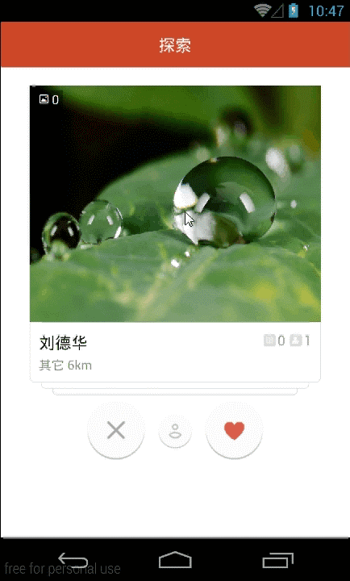

android-card-slide-panel
child-views can be slided to the horizontal edge of the screen and reborn without creating new views
### 序言
故事的起点是这样的- 
* 有一个技术讨论的QQ群，里面活跃着一群技术牛人。他们编码一流，飞天遁地，无所不能。他们知道你所不知的技术，玩过你没有玩过的App。 
* 在一个月高风黑的晚上，一个素未谋面的大侠说：“探探”app做的甚好，滑动流畅，阴影效果32个赞。 
* 致敬经典，怀着崇拜之情，我偷偷下载了这个app，然后在四下无人的时候注册了账号。 
* 我打开了app。 
* 确实惊艳至极，实至名归！卡片式的交互体验，是一种新的创新！ 
* 曾几何时，有一位兄台说过：“boss直聘”app的“每日推荐”左右滑动效果略屌。当时我也下载了，安装了，注册了，还被公司HR发现了。只是当时，感觉ui有点小卡（不要打我，我怕疼）。 
* 时过境迁，“探探”摆在眼前，我知道ViewDragHelper到底能有多牛逼了 
* 终于，我下定了决心要做好这个project 
* 请看图: 
###截图
<td>
	 
	 
</td>

###wait on
模仿"探探"首页的卡片滑动效果，"boss直聘"也有类似的效果。
代码后面上传~
